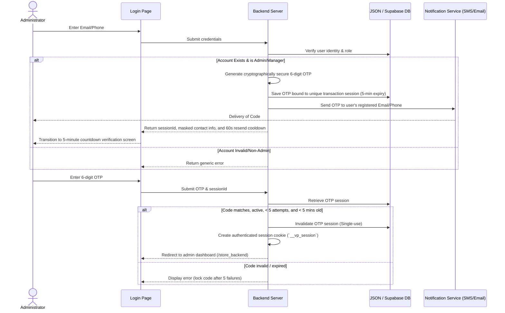

# PetStore Kenya — Administrative Dashboard & 2FA Setup

This document outlines the architecture, security flows, routing, and notification gateway configuration for the **PSK Commerce Administrative Dashboard** (`/store_backend`).

---

## 1. System Overview

The PetStore Kenya (PSK) administrative dashboard is a high-fidelity backend portal built with **React Router v7** and styled with **TailwindCSS**. It provides store managers and administrators with real-time analytics, inventory management, user provisioning, and settings controls. 

To secure the admin environment, all administrator and shop manager accounts are protected by a **Passwordless Two-Factor Authentication (2FA) OTP system** using phone (SMS) and email channels.

---

## 2. Secure Passwordless Authentication Flow



### Security Rules & Constraints
* **Strict Expiry:** SMS and Email OTP sessions expire exactly **5 minutes** after creation.
* **Brute-Force Protection:** A maximum of **5 failed attempts** is allowed per OTP session. The 6th failure invalidates the session, requiring the user to request a new code.
* **Single-Use and Session-Bound:** Every OTP code is cryptographically bound to a unique `sessionId`. Requesting a new code instantly voids any previous code.
* **Rate Limiting:** A maximum of **5 OTP requests** per user identity/IP per hour prevents SMS-bombing and cost inflation.

---

## 3. Administrative Storage & Schema

The admin auth flow relies on the following schema structures within Supabase and the local cache fallbacks (`content/`):

### `users` table
Represents store users. Admin roles are gated strictly to `administrator` and `shop_manager`.
* `id` (Primary Key)
* `name`, `email`, `username`
* `role` (`administrator` | `shop_manager` | `customer`)
* `status` (`active` | `suspended`)
* `phone` (Kenyan format, e.g., `07XXXXXXXX` or `2547XXXXXXXX` for SMS OTP)
* `createdAt`

### `otp_sessions` table (local: `otp_sessions.json`)
Tracks live verification sessions.
* `id` (Primary Key - unique session ID sent to client)
* `userId` (References `users`)
* `target` (Masked recipient contact info, e.g., `ad***@petstore.co.ke` or `******0999`)
* `codeHash` (SHA-256 hash of the 6-digit code)
* `expiresAt` (ISO Timestamp - now + 5 minutes)
* `attempts` (Integer, capped at 5)
* `invalidated` (Boolean single-use flag)
* `createdAt` (ISO Timestamp)

---

## 4. Production Notification Gateway Setup

To transition from the local developer console logs to real-time email and SMS message delivery, complete the setup for both gateways:

### 1. Resend (Email Gateway)
1. **Create Account & Add Domain:** Sign up at [resend.com](https://resend.com), go to **Domains** $\rightarrow$ **Add Domain** $\rightarrow$ enter `petstore.co.ke`.
2. **Add DNS Records:** Add the generated SPF, DKIM, and DMARC TXT/CNAME records inside your DNS provider (e.g. Cloudflare or domain registrar).
3. **Verify Domain:** Click **Verify DNS Records** in Resend. Do not transition to production until status shows green.
4. **Get API Key:** Navigate to **API Keys** $\rightarrow$ **Create API Key**. Restrict permission scope to **Sending access** and save it.

### 2. Africa's Talking (SMS Gateway)
1. **Sandbox Testing:** Start in the sandbox environment for local testing (Username: `"sandbox"`, using Sandbox API Key).
2. **Register Sender ID:** Navigate to **SMS** $\rightarrow$ **Sender IDs** and submit a request for `PETSTORE` (requires telco operator validation).
3. **Setup Production App:** Create a live app separate from the sandbox and top up your account balance (live SMS runs are billed per dispatch).
4. **Get Production Credentials:** Copy the live app's API Key and Username. Set `AT_SENDER_ID=PETSTORE` once approved.

### 3. Production Environment Variables
Set the following environment variables in your deployment host (e.g., Vercel, Railway, PM2):
```bash
RESEND_API_KEY=re_xxxxxxxxxxxxxxxxxxxxxxxx
AT_API_KEY=xxxxxxxxxxxxxxxxxxxxxxxxxxxxxxxxxxxxxxxxxxxxxxxxxxxxxxxxxxxxxxxx
AT_USERNAME=petstore_production
AT_SENDER_ID=PETSTORE
```

---

## 5. Deployment & Testing Checklist

- [ ] **NODE_ENV Toggle:** Ensure `NODE_ENV` is set to `production` in host environments. This activates live API dispatching inside `app/lib/notification.server.ts` instead of logging codes to the console.
- [ ] **Verify Deliverability:** Trigger a test login with your administrator details. Check that the email lands in your inbox (not spam) and the SMS displays `PETSTORE` as the sender.
- [ ] **Setup Balance Alerts:** Configure low-balance notifications in Africa's Talking to prevent silent auth failures.
- [ ] **Staging Safeguards:** Keep local development environments pointing to `NODE_ENV !== "production"` so developers retrieve OTP codes via local console outputs.

---

## 6. Administrative Routes Map

All admin panel routes are nested under the `/store_backend` route segment:

* **`/store_backend/login`:** Passwordless login gate. Seeds the system admin (`admin@petstore.co.ke`) if missing.
* **`/store_backend` (Dashboard):** Summary statistics (Sales, Orders, User activity), analytical charts, and action history logs.
* **`/store_backend/products`:** Control panel for inventory, pricing sync checks, and item details.
* **`/store_backend/users`:** Provision, suspend, or manage roles and phone numbers of back-office users.
* **`/store_backend/posts`:** Manage blog posts, categories, drafts, and publishing status.
* **`/store_backend/coupons`:** Manage promotional codes and usage rules.
* **`/store_backend/settings`:** Customize store settings, toggle registration parameters, and configure system details.
