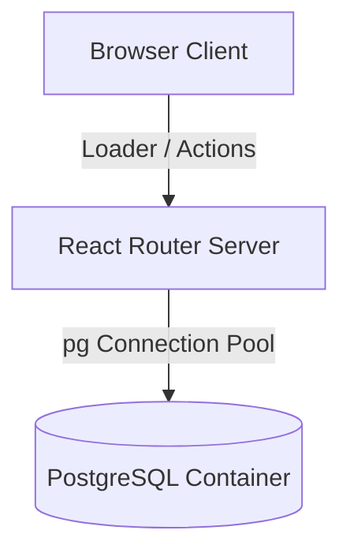

# System Architecture & Design Guidelines

This document details the architectural layout, core patterns, and design guidelines for the **PetStore Kenya** storefront and admin application.

## System Overview

PetStore Kenya uses a hybrid client/server React Router v7 structure running on Node.js, backed by a PostgreSQL database container.

---

## 1. Database Layer (`app/db.server.ts`)

We implement a production-grade PostgreSQL pool configuration utilizing `pg`:
- **Pool Management**: Restricts max client connections to limit resource consumption, uses idle timeout (`30s`), and limits max connection lifecycle query count (`7500`) to prevent memory leaks.
- **Auto Migrations**: Migrations are specified as clean bundle-safe SQL strings inside `app/db/migrations.ts` and run programmatically inside the database pool initializer on startup. This avoids deploying raw `.sql` files to production and guarantees database consistency before page loaders run.
- **Graceful Shutdown**: Listens for termination signals (`SIGTERM`, `SIGINT`) to drain connections before the process exits.
- **Transaction Safety**: All mutative operations (e.g., checkout/order actions and product creation) use the `withTransaction` callback wrapper to ensure atomicity.

---

## 2. API & Transaction Integrity

Mutative operations like `api/order` utilize PostgreSQL transactions:
1. **Validation**: Check for correct numbers, non-empty arrays, and required inputs.
2. **Customer Upsert**: Automatically matches or creates a customer using their unique phone number.
3. **Atomic Writes**: Inserts both the `orders` header and multiple `order_items` in a single transaction. If any item insert fails, the order is rolled back to prevent orphaned states.

---

## 3. Session & Authentication

To support a simple but secure local operation, we use **PIN-Based Cookie Sessions**:
- The admin login page asks for the `ADMIN_PIN` environment variable.
- On success, it issues a signed/encoded `admin_pin` cookie with `HttpOnly`, `SameSite=Lax`, and a max-age of 24 hours.
- The root layout loader `/admin` intercepts requests, validates the cookie, and handles clean redirections.
- Logout is handled by submitting a form that sends a `Set-Cookie` with a past expiration date to clear the browser session.

---

## 4. UI styling & Aesthetic Guidelines

- **Storefront**: Kraft paper neo-brutalist theme utilizing cream backgrounds (`#F2EBE0`), stamp-on-kraft black borders, and flag colors (Green/Red/Black) for accents.
- **Admin Panel**: Styled using a dedicated CSS stylesheet (`app/admin.css`) that isolation-wraps pages. Uses dark background colors (`#090909`), deep gray cards (`#121212`), high contrast typography, and flat borders.
