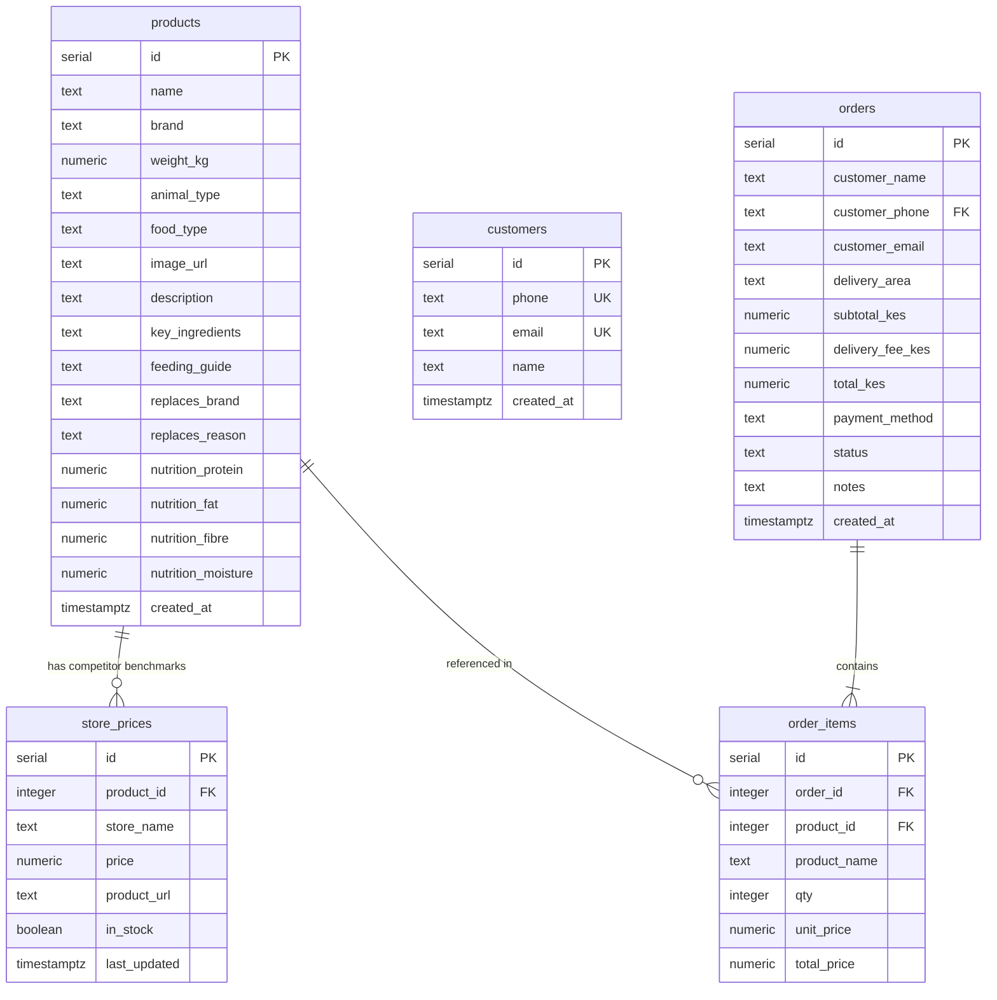

# Database Schema Reference

This document maps out the database tables, relations, fields, and indexing strategies utilized in the PetStore Kenya application.

## Entity-Relationship Schema

---

## Tables & Details

### 1. `products`
The core catalog table. Contains metadata for each item.
- `id` (SERIAL PRIMARY KEY)
- `name` (TEXT, NOT NULL)
- `brand` (TEXT)
- `weight_kg` (NUMERIC(8,2))
- `animal_type` (TEXT) - e.g., 'dog', 'cat'
- `food_type` (TEXT) - e.g., 'dry', 'wet', 'treat'
- `replaces_brand`/`replaces_reason` (TEXT) - Used for comparison logic against imported brands on the storefront.
- `nutrition_protein`/`nutrition_fat`/`nutrition_fibre`/`nutrition_moisture` (NUMERIC(5,1)) - Used to display nutrient sheets.

### 2. `store_prices`
Tracks pricing benchmarks for PetStore Kenya and competitors (Carrefour, Naivas, Jumia).
- `id` (SERIAL PRIMARY KEY)
- `product_id` (INTEGER, REFERENCES `products(id)` ON DELETE CASCADE)
- `store_name` (TEXT, NOT NULL) - e.g. 'PetStore Kenya', 'Carrefour'
- `price` (NUMERIC(10,2))
- `product_url` (TEXT) - Deep link to competitor listing
- `in_stock` (BOOLEAN)

### 3. `customers`
Registry of distinct customers.
- `id` (SERIAL PRIMARY KEY)
- `phone` (TEXT, UNIQUE) - Core lookup identifier
- `email` (TEXT, UNIQUE)
- `name` (TEXT)

### 4. `orders`
Header records for checkouts.
- `id` (SERIAL PRIMARY KEY)
- `customer_name` (TEXT)
- `customer_phone` (TEXT, NOT NULL)
- `customer_email` (TEXT)
- `delivery_area` (TEXT)
- `total_kes` (NUMERIC(10,2))
- `status` (TEXT, DEFAULT 'pending') - 'pending', 'confirmed', 'preparing', 'out_for_delivery', 'delivered', 'cancelled'.

### 5. `order_items`
Details of items checked out in each order.
- `id` (SERIAL PRIMARY KEY)
- `order_id` (INTEGER, REFERENCES `orders(id)` ON DELETE CASCADE)
- `product_id` (INTEGER, REFERENCES `products(id)` ON DELETE SET NULL)
- `qty` (INTEGER)
- `unit_price` (NUMERIC(10,2))
- `total_price` (NUMERIC(10,2))

---

## Indexing Strategy
To optimize analytical dashboard performance and prevent lookup lag, we define:
- `idx_store_prices_product`: Index on `store_prices(product_id)` to speed up product-level price list lookups.
- `idx_store_prices_store`: Index on `store_prices(store_name)` to accelerate competitor specific filtering.
- `idx_orders_status`: Index on `orders(status)` to speed up status-specific admin filter loads.
- `idx_orders_phone`: Index on `orders(customer_phone)` to fetch customer purchase histories quickly.
